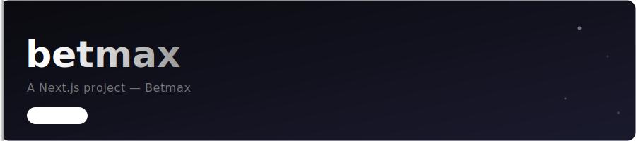

# betmax

A Next.js project — Betmax

## Tech Stack

| Layer | Technology |
|-------|------------|
| Framework | Next.js |
| Language | TypeScript |
| Styling | Tailwind CSS |

## Getting Started

```bash
# Clone the repository
git clone https://github.com/Ross-Ward/betmax.git
cd betmax
```

```bash
npm install
npm run dev
```

## Deployment

[](https://vercel.com/new/clone?repository-url=https://github.com/Ross-Ward/betmax)

```bash
vercel --prod
```

## Author

**Ross Ward** — [github.com/Ross-Ward](https://github.com/Ross-Ward)

## License

MIT
